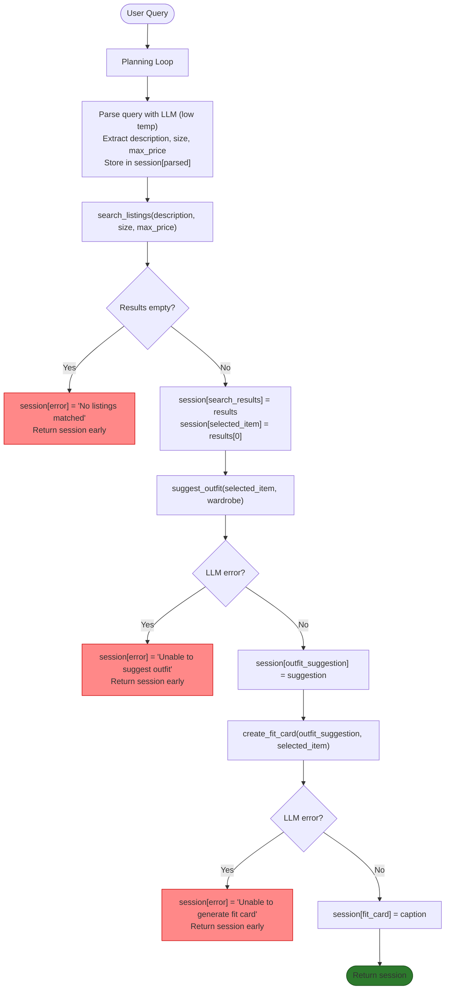

# FitFindr

A multi-tool AI agent that helps users find secondhand clothing and figure out how to wear it. The agent searches mock thrift listings, suggests outfits based on the user's wardrobe, and generates a shareable caption — all from a single natural language query.

## Setup

```bash
pip install -r requirements.txt
```

Create a `.env` file in the project root:
```
GROQ_API_KEY=your_key_here
```

## How to Run

```bash
python app.py
```

Then open the localhost URL shown in your terminal.

---

## Architecture



---

## Tool Inventory

### search_listings

**Purpose:**
The user's input is used by the agent to extract 3 things: the description of the clothing they want, the size they want for that clothing item, and the max_price they are willing to pay for it. The tool/function search_listings() then uses these 3 extracted attributes as input parameters and returns all matching clothing items from the listings sorted by relevance.

**Inputs:**
- `description` (str): The description of the clothing the user wants.
- `size` (str): The size in which the user wants the clothing item.
- `max_price` (float): The maximum price the user is willing to pay for this clothing item.

**Output:**
Returns all matches as a list of dictionaries sorted by relevance (relevance is measured by counting how many keywords from the description appear in the listing's title, description, category, and style_tags). Listings with a score of 0 are dropped. Each dictionary includes fields {"id", "title", "description", "category", "style_tags", "size", "condition", "price", "colors", "brand", "platform"}.

---

### suggest_outfit

**Purpose:**
The tool suggest_outfit() takes a listing dict and a wardrobe dict, then calls the LLM to generate 1–2 complete outfit suggestions using the new item paired with pieces from the wardrobe. If the wardrobe is empty, it falls back to general styling advice for the item instead.

**Inputs:**
- `new_item` (dict): A dictionary containing all information about the new clothing item. Fields: `id` (str), `title` (str), `description` (str), `category` (str), `style_tags` (list[str]), `size` (str), `condition` (str), `price` (float), `colors` (list[str]), `brand` (str or None), `platform` (str).
- `wardrobe` (dict): A dictionary with a single key `items`, which maps to a list of wardrobe item dicts. Each wardrobe item has: `id` (str), `name` (str), `category` (str), `colors` (list[str]), `style_tags` (list[str]), `notes` (str or None). May be empty — `wardrobe["items"]` will be an empty list for a new user.

**Output:**
A non-empty string with 1–2 outfit suggestions. Each suggestion references specific wardrobe pieces by name (e.g. "pair with your dark wash baggy jeans and chunky white sneakers"), describes the overall aesthetic or vibe, and may include a small styling tip (e.g. tuck, roll sleeves). If the wardrobe is empty, returns general advice on what types of pieces pair well with the item and what aesthetic it suits.

---

### create_fit_card

**Purpose:**
It takes the outfit suggestion string and the new item from the listings as inputs. It calls the LLM with higher temperature and then generates a short, shareable outfit caption for the thrifted find that the user can use on their Instagram/Tiktok post.

**Inputs:**
- `outfit` (str): The outfit suggestion string. May be empty or whitespace-only if suggest_outfit() failed — the tool must check for this before calling the LLM.
- `new_item` (dict): The listing dict for the thrifted item. The tool uses `title` (str), `price` (float), and `platform` (str) from this dict to reference the item naturally in the caption.

**Output:**
Returns a 2-4 sentence long caption as a string for the user to use as a caption for their new Instagram/TikTok post. The caption feels casual and authentic (like a real OOTD post, not a product description). Mentions the item name, price, and platform naturally (once each). Captures the outfit vibe in specific terms. Sounds different each time for different inputs (uses higher LLM temperature).

---

## Planning Loop

- Step 1: First the agent looks at the user's input of what type of new clothing item they want. Then the agent asks the LLM (low temperature) to extract 3 things from it: the description of the clothing, the size of the item, and the maximum price the user is willing to pay. If the user did not mention a size or price, the LLM should return `None` for that field. The extracted values are stored in `session["parsed"]` as `{"description": str, "size": str or None, "max_price": float or None}`.

- Step 2: Then these attributes are given to `search_listings()` as input and the tool is run. After that, the agent checks the returned value from the tool.
     1. If it is empty or an error was caused, then `session["error"]` = "Try some other attributes because the attributes you gave were not matched with any listings." and `session["error"]` is returned. The agent stops the loop here and does not call the next function (`suggest_outfit()`).
     2. If the `search_listings()` tool does return the matched items, then they are put into `session["search_results"]`, then the top item from that returned list is saved in `session["selected_item"]`.

- Step 3: Then `suggest_outfit()` is called:
     1. If there is an LLM/API error, then `session["error"]` = "FitFindr found your item but was unable to generate a styling suggestion. The item found was: {title} — ${price} on {platform}." and `session["error"]` is returned. Do not raise an exception and stop the loop.
     2. If it returns a string, then the suggestion is saved in `session["outfit_suggestion"]` and the agent calls the next function `create_fit_card()`.

- Step 4: Then `create_fit_card()` is run:
     1. If there was an LLM error, then `session["error"]` = "FitFindr found your item but was unable to generate a fit caption. The item was: {title} — ${price} on {platform}." and `session["error"]` is returned. Do not raise an exception.
     2. If it does return a string, then save that in `session["fit_card"]` and return that to the user as the final output.

---

## State Management

A session dict is initialized at the start of each run and acts as the shared state for the entire interaction. Each tool writes its output into a key in this dict, and the next tool reads from it rather than receiving values directly.

Keys tracked: `session["parsed"]` (extracted description/size/price), `session["search_results"]` (listings found), `session["selected_item"]` (top result, passed to suggest_outfit), `session["outfit_suggestion"]` (passed to create_fit_card), `session["fit_card"]` (final output), and `session["error"]` (set if the loop exits early, None on success).

---

## Error Handling

| Tool | Failure mode | Agent response |
|------|-------------|----------------|
| search_listings | No results match the query | "Try some other attributes because the attributes you gave were not matched with any listings." |
| suggest_outfit | 1. Wardrobe is empty 2. LLM error | 1. general styling advice for the item instead of wardrobe-specific combinations 2. "FitFindr found your item but was unable to generate a styling suggestion. The item found was: {title} — ${price} on {platform}." |
| create_fit_card | 1. Outfit input is missing or incomplete 2. LLM error | 1. "No outfit suggestion was available to generate a caption from." 2. "FitFindr found your item but was unable to generate a fit caption. The item was: {title} — ${price} on {platform}." |

### Concrete Testing Example

Testing `create_fit_card` with an empty outfit string triggers the input guard before the LLM is called:

```python
from tools import search_listings, create_fit_card
results = search_listings('vintage graphic tee', size=None, max_price=50)
print(create_fit_card('', results[0]))
```

Output:
```
No outfit suggestion was available to generate a caption from.
```

The tool returned the error string immediately without making an LLM call, which is the expected behaviour for the empty outfit input guard.

---

## Spec Reflection

**One way the spec helped you during implementation:**


**One way your implementation diverged from the spec, and why:**


## AI Usage

**Instance 1**

- *What I gave the AI:*


- *What it produced:*


- *What I changed or overrode:*


**Instance 2**

- *What I gave the AI:*


- *What it produced:*


- *What I changed or overrode:*
