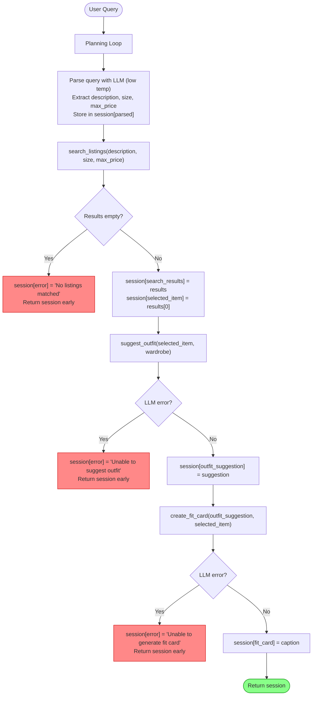

# FitFindr — planning.md

> Complete this document before writing any implementation code.
> Your spec and agent diagram are what you'll use to direct AI tools (Claude, Copilot, etc.) to generate your implementation — the more specific they are, the more useful the generated code will be.
> Your planning.md will be reviewed as part of your submission.
> Update it before starting any stretch features.

---

## Tools

List every tool your agent will use. For each tool, fill in all four fields.
You must have at least 3 tools. The three required tools are listed — add any additional tools below them.

### Tool 1: search_listings

**What it does:**
The user's input is used by the agent to extract 3 things: the description of the clothing they want, the size they want for that clothing item, and the max_price they are willing to pay for it. The tool/function search_listings() then uses these 3 extracted attributes as input parameters and returns the top 3 clothing items from the listings which match the input parameters.

**Input parameters:**
- `description` (str): The description of the clothing the user wants.
- `size` (str): The size in which the user wants the clothing item.
- `max_price` (float): The maximum price the user is willing to pay for this clothing item.

**What it returns:**
The function/tool returns the top 3 matches as a list of dictionaries sorted by relevance (relevance will be measured by finding a score of how many paramters directly matched with the item) from the listings according to the input paramters it received. Each dictionary includes fields {"id", "title", "description", "category", "style_tags", "size", "condition", "price", "colors", "brand", "platform"}.

**What happens if it fails or returns nothing:**
If the tool fails or returns nothing, then the user is told to try some other attributes because the attributes they gave were not matched with any listings. Also, the agent stops the loop here and does not call the next function (suggest_outfit()).

---

### Tool 2: suggest_outfit

**What it does:**
The tool suggest_outfit() takes a listing dict and a wardrobe dict, then calls the LLM to generate 1–2 complete outfit suggestions using the new item paired with pieces from the wardrobe. If the wardrobe is empty, it falls back to general styling advice for the item instead.

**Input parameters:**
- `new_item` (dict): A dictionary containing all information about the new clothing item. Fields: `id` (str), `title` (str), `description` (str), `category` (str), `style_tags` (list[str]), `size` (str), `condition` (str), `price` (float), `colors` (list[str]), `brand` (str or None), `platform` (str).
- `wardrobe` (dict): A dictionary with a single key `items`, which maps to a list of wardrobe item dicts. Each wardrobe item has: `id` (str), `name` (str), `category` (str), `colors` (list[str]), `style_tags` (list[str]), `notes` (str or None). May be empty — `wardrobe["items"]` will be an empty list for a new user.

**What it returns:**
A non-empty string with 1–2 outfit suggestions. Each suggestion references specific wardrobe pieces by name (e.g. "pair with your dark wash baggy jeans and chunky white sneakers"), describes the overall aesthetic or vibe, and may include a small styling tip (e.g. tuck, roll sleeves). If the wardrobe is empty, returns general advice on what types of pieces pair well with the item and what aesthetic it suits.

**What happens if it fails or returns nothing:**
- Empty wardrobe (expected case): the tool does not fail — it returns general styling advice for the item instead of wardrobe-specific combinations.
- LLM/API error (actual failure): return the string "FitFindr found your item but was unable to generate a styling suggestion. The item found was: {title} — ${price} on {platform}." Do not raise an exception. 

---

### Tool 3: create_fit_card

**What it does:**
It takes the outfit suggestion string and the new item from the listings as inputs. It calls the LLM with higher temperature and then generates a short, shareable outfit caption for the thrifted find that the user can use on their Instagram/Tiktok post.

**Input parameters:**
- `outfit` (str): The outfit suggestion string. May be empty or whitespace-only if suggest_outfit() failed — the tool must check for this before calling the LLM.
- `new_item` (dict): The listing dict for the thrifted item. The tool uses `title` (str), `price` (float), and `platform` (str) from this dict to reference the item naturally in the caption.

**What it returns:**
It returns a 2-4 sentence long caption as a String for the user to use as a caption for their new instagram/tiktom post. The caption should feel casual and authentic (like a real OOTD post, not a product description). Mention the item name, price, and platform naturally (once each). Capture the outfit vibe in specific terms. Sound different each time for different inputs (use higher LLM temperature)

**What happens if it fails or returns nothing:**
- Empty/whitespace `outfit` string (input guard): return "No outfit suggestion was available to generate a caption from." Do not call the LLM.
- LLM/API error (actual failure): return "FitFindr found your item but was unable to generate a fit caption. The item was: {title} — ${price} on {platform}." Do not raise an exception.

---

### Additional Tools (if any)

No additional tools will be used

---

## Planning Loop

**How does your agent decide which tool to call next?**

- Step 1: First the agent looks at the user's input of what type of new clothing item they want. Then the agent asks the LLM (low temperature) to extract 3 things from it: the description of the clothing, the size of the item, and the maximum price the user is willing to pay. If the user did not mention a size or price, the LLM should return `None` for that field. The extracted values are stored in `session["parsed"]` as `{"description": str, "size": str or None, "max_price": float or None}`.

- Step 2: Then these attributes are given to `search_listings()` as input and the tool is run. After that, the agent checks the returned value from the the tool. 
     1. If it is empty or an error was caused, then `session["error"]`="Try some other attributes because the attributes you gave were not matched with any listings." and `session["error"]` is returned. Also, the agent stops the loop here and does not call the next function (`suggest_outfit()`). 
     2. If the `search_listings()` tool does return the matched items, then they are put into `session["search_results"]`, then the top item from that returned list is saved in a variable in `session["selected_item"]`. 

- Step 3: Then `suggest_outfit()` is called:
     1. If the LLM/API error, then `session["error"]`= "FitFindr found your item but was unable to generate a styling suggestion. The item found was: {title} — ${price} on {platform}." and `session["error"]` is returned. Do not raise an exception and stop the loop. 
     2. If it returns a string, then the suggestion is saved in `session["outfit_suggestion"]` and the agent calls the next function `create_fit_card()`. 

- Step 4: Then `create_fit_card()` is run and 
     1. If there was an LLM error, then `session["error"]`= "FitFindr found your item but was unable to generate a fit caption. The item was: {title} — ${price} on {platform}." and `session["error"]` is returned. Do not raise an exception. 
     2. If it does return a string, then save that in `session["fit_card"]`and return that to the user as the final output.

---

## State Management

**How does information from one tool get passed to the next?**
A session dict is initialized at the start of each run and acts as the shared state for the entire interaction. Each tool writes its output into a key in this dict, and the next tool reads from it rather than receiving values directly.

Keys tracked: `session["parsed"]` (extracted description/size/price), `session["search_results"]` (listings found), `session["selected_item"]` (top result, passed to suggest_outfit), `session["outfit_suggestion"]` (passed to create_fit_card), `session["fit_card"]` (final output), and `session["error"]` (set if the loop exits early, None on success).

---

## Error Handling

For each tool, describe the specific failure mode you're handling and what the agent does in response.

| Tool | Failure mode | Agent response |
|------|-------------|----------------|
| search_listings | No results match the query | "Try some other attributes because the attributes you gave were not matched with any listings." |
| suggest_outfit | 1. Wardrobe is empty 2. LLM error | 1. general styling advice for the item instead of wardrobe-specific combinations 2. "FitFindr found your item but was unable to generate a styling suggestion. The item found was: {title} — ${price} on {platform}." |
| create_fit_card | 1. Outfit input is missing or incomplete 2. LLM error | 1. "No outfit suggestion was available to generate a caption from." 2. "FitFindr found your item but was unable to generate a fit caption. The item was: {title} — ${price} on {platform}." |

---

## Architecture

---

## AI Tool Plan

**Milestone 3 — Individual tool implementations:**

I'll use Claude for all 3 tools one at a time. For each tool I'll give it the tool spec from this planning.md and ask it to implement it using the existing helper functions. I'll verify each tool works by testing it with a few inputs before moving to the next one. For `search_listings` I'll test with different queries, for `suggest_outfit` I'll test with both an empty and a full wardrobe, and for `create_fit_card` I'll test with a normal outfit and an empty string.

**Milestone 4 — Planning loop and state management:**

I'll give Claude the Planning Loop section, State Management section, and the Architecture diagram and ask it to implement `run_agent()`. I'll verify by running the CLI test at the bottom of `agent.py` and checking that the happy path returns a fit card and the no-results path returns the error message. (Took help from Claude to write this)

---

## A Complete Interaction (Step by Step)

Write out what a full user interaction looks like from start to finish — tool call by tool call. Use a specific example query.

**Example user query:** "I'm looking for a vintage graphic tee under $30. I mostly wear baggy jeans and chunky sneakers. What's out there and how would I style it?"

**Step 1:**
The agent asks the LLM (low temperature) to parse the input and extract 3 things: description = "vintage graphic tee", size = None (not mentioned by user), max_price = 30.0. These are stored in `session["parsed"]` and passed to `search_listings()`.

**Step 2:**
`search_listings()` returns a list of matching listing dicts sorted by relevance score, stored in `session["search_results"]`. FitFindr then picks the top result from this list and saves it in `session["selected_item"]`. `suggest_outfit()` is then called with `session["selected_item"]` and `session["wardrobe"]` as parameters. It returns a string with 1–2 outfit suggestions referencing specific wardrobe pieces by name, stored in `session["outfit_suggestion"]`. This output is then given to the next `create_fit_card()` function.

**Step 3:**
`create_fit_card()` takes `session["outfit_suggestion"]` and `session["selected_item"]` as parameters. It calls the LLM at higher temperature and uses the item's title, price, and platform to generate a 2–4 sentence casual caption. The result is saved in `session["fit_card"]` and returned to the user.

**Final output to user:**
"thrifted this faded band tee off depop for $22 and honestly it was made for my wide-legs 🖤 full look in my stories"
